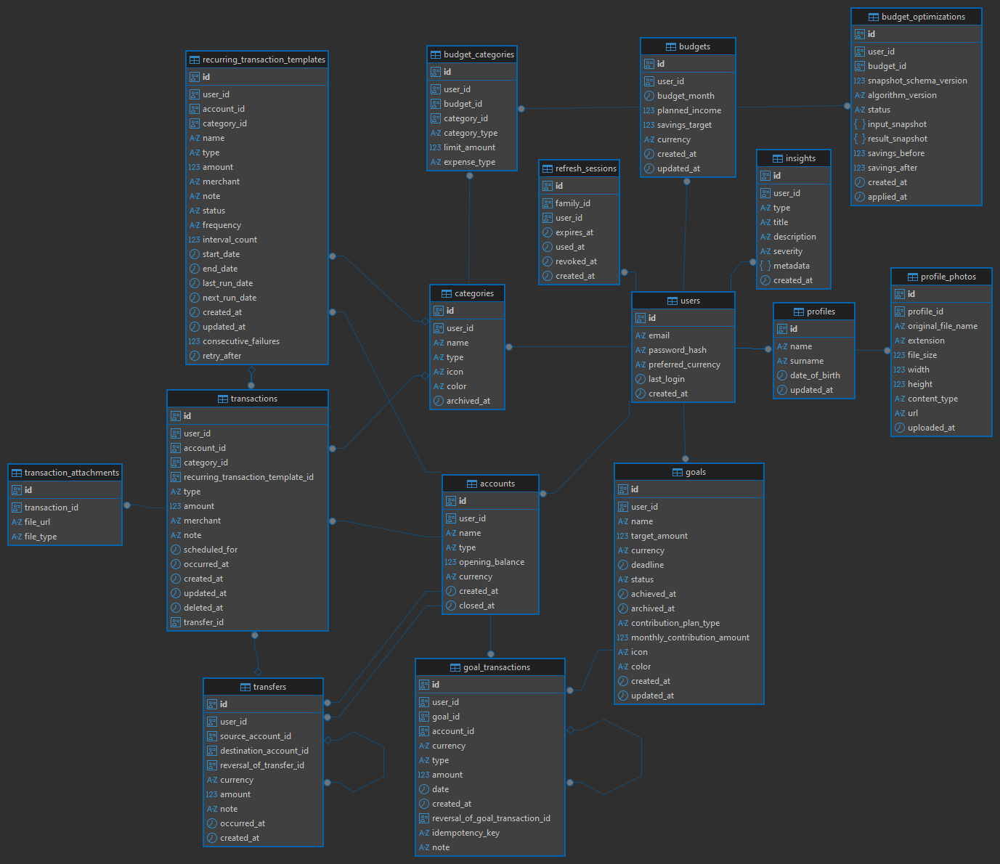

# Certis API

Backend API for **Certis**, a personal finance management application built with Kotlin and Spring Boot.

[](https://github.com/DanyaChetvyrtov/certis-api/actions/workflows/ci.yml)


## Overview

Certis API provides the backend for managing personal finances: accounts, transactions, transfers, recurring operations, categories, budgets, savings goals, profile data, and financial analytics.

The project uses a feature-oriented architecture with explicit command/query boundaries, thin HTTP controllers, jOOQ-based persistence, Liquibase migrations, cookie-based JWT authentication, and automated quality checks in CI.

Current development version: `0.0.2-SNAPSHOT`.

## Features

- Registration, login, logout, refresh-token rotation, and session management.
- Cookie-based JWT authentication and Spring Security authorization.
- Authentication rate limiting with Bucket4j and Caffeine.
- User profile management and profile photo storage in MinIO.
- Multiple financial accounts with balances and currencies.
- Income and expense transactions.
- Transfers between accounts.
- Recurring transactions with scheduled execution and catch-up processing.
- Custom categories with archive/restore flows.
- Category analytics, including monthly spending and spending-over-time series.
- Monthly budgets and budget allocation/optimization flows.
- Savings goals, progress tracking, contribution planning, and contributions.
- Dashboard-oriented transaction and cash-flow analytics.
- Health checks through Spring Boot Actuator.
- Optional OpenAPI/Swagger documentation for local development.

## Tech stack

| Area | Technology |
| --- | --- |
| Language | Kotlin 2.2.20, Java 21 |
| Framework | Spring Boot 3.5.16 |
| Web | Spring MVC, Jakarta Bean Validation |
| Security | Spring Security, JJWT 0.12.6 |
| Database | PostgreSQL 17 |
| Persistence | jOOQ 3.20.9 |
| Migrations | Liquibase 4.33.0 |
| Mapping | MapStruct 1.6.3 |
| Object storage | MinIO |
| Rate limiting | Bucket4j + Caffeine |
| API docs | springdoc-openapi |
| Tests | JUnit 5, Spring Boot Test, MockMvc, AssertJ, ArchUnit, embedded PostgreSQL |
| Quality | ktlint, detekt, JaCoCo |
| Build | Gradle Wrapper |
| CI/CD | GitHub Actions, Docker |

## Architecture

Business code is organized by feature under:

```text
src/main/kotlin/ru/digitalhustle/certis/
├── api/                 # HTTP boundary: controllers, DTOs, mappers, API constants
├── config/              # Spring and infrastructure configuration
├── exception/           # Shared exception handling
├── features/
│   ├── account/
│   ├── budget/
│   ├── category/
│   ├── goal/
│   ├── profile/
│   ├── security/
│   └── transaction/
├── scheduler/           # Scheduled jobs
├── shared/              # Deliberately shared cross-feature building blocks
└── util/                # Small cross-feature utilities
```

Within a feature, responsibilities are separated into focused layers such as:

```text
features/<feature>/
├── application/         # Use-case orchestration
├── command/             # State-changing operations
├── query/               # Read models, filters, analytics, projections
├── api/                 # Public contracts exposed to other features
├── spi/                 # Consumer-owned ports for dependency inversion
├── model/               # Feature-owned shared models
├── constants/           # Feature-owned constants
└── gateway/             # External-system adapters when required
```

The main HTTP dependency direction is:

```text
controller -> application / command / query service -> repository
```

Cross-feature state changes go through a feature's public API instead of reaching directly into another feature's internal services or repositories.

More detailed architectural rules are documented in [`AGENTS.md`](./AGENTS.md).

## Database schema

The current PostgreSQL `keeper` schema, including the main tables, foreign-key relationships, composite ownership/currency constraints, and important database invariants, is documented in [`docs/database-schema.md`](./docs/database-schema.md).



## Prerequisites

Install the following before running the application locally:

- JDK 21
- Docker and Docker Compose
- Git

A system-wide Gradle installation is not required; use the included Gradle Wrapper.

## Local development

### 1. Clone the repository

```bash
git clone https://github.com/DanyaChetvyrtov/certis-api.git
cd certis-api
git checkout dev
```

### 2. Start PostgreSQL and MinIO

```bash
docker compose up -d
```

The local Compose configuration starts:

- PostgreSQL on `localhost:5432`
- MinIO API on `localhost:9000`
- MinIO Console on `localhost:9001`

Default local infrastructure credentials from `docker-compose.yml` are:

```text
PostgreSQL database: certis
PostgreSQL user:     postgres
PostgreSQL password: root

MinIO access key:    admin
MinIO secret key:    root1234
```

These credentials are intended for local development only.

### 3. Configure environment variables

Use [`.env.example`](./.env.example) as the reference for supported environment variables.

At minimum, a local configuration should provide values equivalent to:

```dotenv
DB_HOST=localhost
DB_PORT=5432
DB_NAME=certis
DB_USER=postgres
DB_PASSWORD=root
DB_SCHEMA=keeper

PUBLIC_API_URL=http://localhost:8080
APPLICATION_TIME_ZONE=UTC
SWAGGER_ENABLED=true

JWT_SECRET=replace-with-a-long-random-secret
ACCESS_TOKEN_DURATION=30m
REFRESH_TOKEN_DURATION=7d

MINIO_HOST=localhost
MINIO_PORT=9000
MINIO_ACCESS_KEY=admin
MINIO_SECRET_KEY=root1234
MINIO_BUCKET_NAME=certis
```

> `.env.example` is a configuration template. Make sure the variables are actually available to the Gradle/Spring process through your shell, IDE run configuration, or another environment-loading mechanism.

Recurring-transaction scheduler settings can also be overridden with the `RECURRING_TRANSACTION_SCHEDULER_*` variables listed in `.env.example`.

### 4. Apply database migrations

Runtime Liquibase execution is disabled in `application.yml`, so schema changes are applied explicitly through Gradle:

```bash
./gradlew update
```

On Windows:

```powershell
.\gradlew.bat update
```

Database tasks accept either `DB_*` environment variables or corresponding Gradle properties such as `-Pdb.user=...` and `-Pdb.password=...`.

### 5. Generate jOOQ sources

After applying migrations, generate the jOOQ model from the current database schema:

```bash
./gradlew generateJooq
```

On Windows:

```powershell
.\gradlew.bat generateJooq
```

Generated sources are written to `build/generated-sources` under the `org.jooq.generated` package.

### 6. Run the application

```bash
./gradlew bootRun
```

On Windows:

```powershell
.\gradlew.bat bootRun
```

The API starts on:

```text
http://localhost:8080
```

On startup, the application creates the configured MinIO bucket if it does not already exist.

## API documentation

Swagger is disabled by default. Enable it with:

```dotenv
SWAGGER_ENABLED=true
```

Then open:

```text
http://localhost:8080/swagger-ui/index.html
```

The OpenAPI document is available at:

```text
http://localhost:8080/v3/api-docs
```

## Health check

The application exposes the Actuator health endpoint:

```text
GET http://localhost:8080/actuator/health
```

Only the health endpoint is exposed by default, and detailed internal health information is not returned publicly.

## Testing and quality checks

Run the test suite:

```bash
./gradlew test
```

Run the same primary verification task used by CI:

```bash
./gradlew check
```

`check` includes:

- automated tests
- detekt
- ktlint
- JaCoCo coverage verification

The project currently enforces a minimum JaCoCo instruction coverage ratio of `70%` for the configured coverage scope.

Useful individual commands:

```bash
./gradlew ktlintCheck
./gradlew ktlintFormat
./gradlew detekt
./gradlew jacocoTestReport
./gradlew jacocoTestCoverageVerification
```

Integration tests use embedded PostgreSQL where appropriate, while CI also starts PostgreSQL and verifies Liquibase migrations before running project checks.

## Database change workflow

When adding or modifying database structures:

1. Add a Liquibase changeset under `src/main/resources/db/changelog`.
2. Start the local PostgreSQL instance.
3. Apply migrations with `./gradlew update`.
4. Regenerate jOOQ sources with `./gradlew generateJooq`.
5. Update [`docs/database-schema.md`](./docs/database-schema.md) when tables or relationships change.
6. Update repositories, services, mappings, and tests as required.
7. Run `./gradlew check` before opening or merging a PR.

Do not manually edit generated jOOQ sources.

## Configuration

Important configuration groups include:

| Environment variable | Purpose | Default |
| --- | --- | --- |
| `DB_HOST` | PostgreSQL host | `localhost` |
| `DB_PORT` | PostgreSQL port | `5432` |
| `DB_NAME` | PostgreSQL database | `certis` |
| `DB_USER` | PostgreSQL user | `postgres` at Spring runtime |
| `DB_PASSWORD` | PostgreSQL password | `root` at Spring runtime |
| `DB_SCHEMA` | jOOQ input schema | `keeper` |
| `PUBLIC_API_URL` | Public API base URL | `http://localhost:8080` |
| `APPLICATION_TIME_ZONE` | Application business time zone | `UTC` |
| `SWAGGER_ENABLED` | Enable OpenAPI docs and Swagger UI | `false` |
| `JWT_SECRET` | JWT signing secret | required |
| `ACCESS_TOKEN_DURATION` | Access-token lifetime | `30m` |
| `REFRESH_TOKEN_DURATION` | Refresh-token lifetime | `7d` |
| `MINIO_HOST` | MinIO host | required |
| `MINIO_PORT` | MinIO port | required |
| `MINIO_ACCESS_KEY` | MinIO access key | required |
| `MINIO_SECRET_KEY` | MinIO secret key | required |
| `MINIO_BUCKET_NAME` | MinIO bucket used by the application | required |

Authentication rate-limit parameters and recurring scheduler settings can also be overridden through environment variables defined in `application.yml` and `.env.example`.

## CI

Pull requests targeting `dev` or `master` run the GitHub Actions CI pipeline. The pipeline:

1. starts PostgreSQL 17;
2. applies Liquibase migrations;
3. runs tests, detekt, ktlint, and JaCoCo verification;
4. publishes test and static-analysis reports;
5. validates the Docker image when Docker build inputs change.

## Branching

The repository currently uses:

- `dev` as the active integration branch for feature PRs;
- `master` as the release branch;
- short-lived `feature/*`, `fix/*`, `refactor/*`, or `docs/*` branches for isolated changes.

New development should normally be based on the latest `dev` and merged through a pull request.
